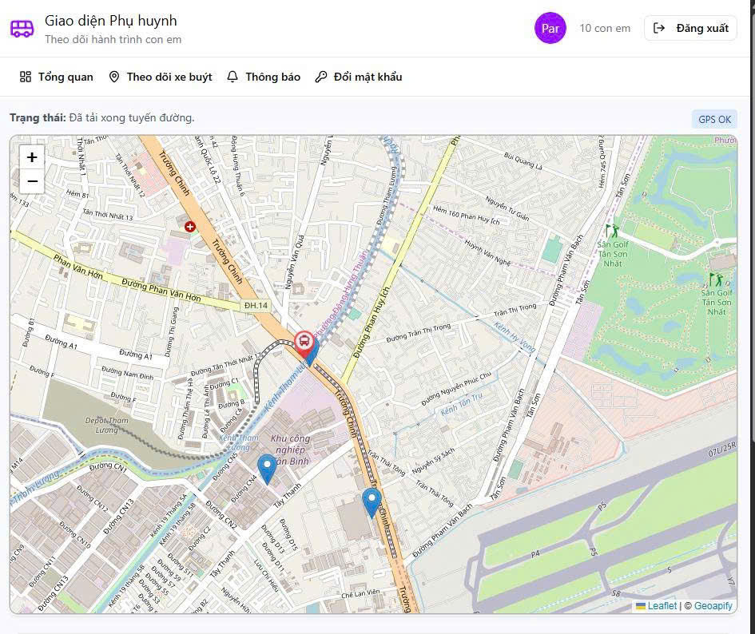
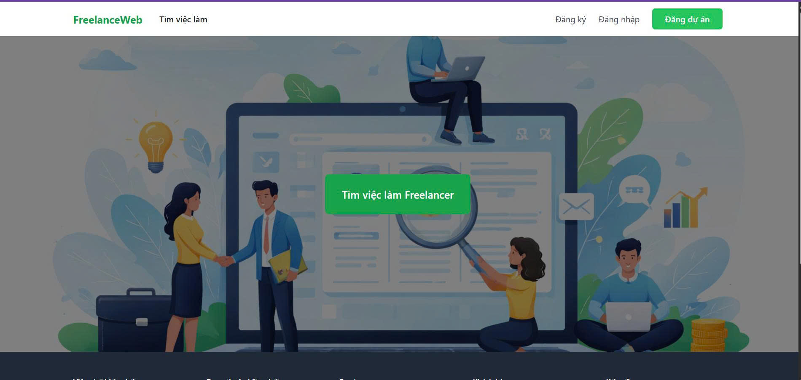
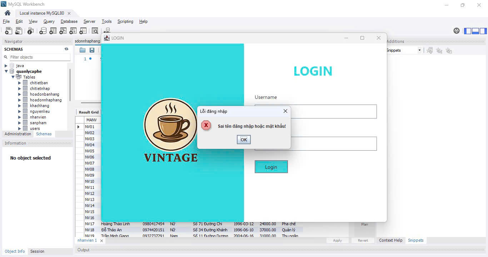
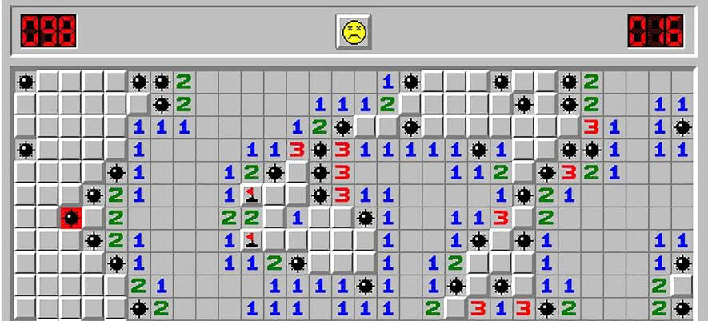
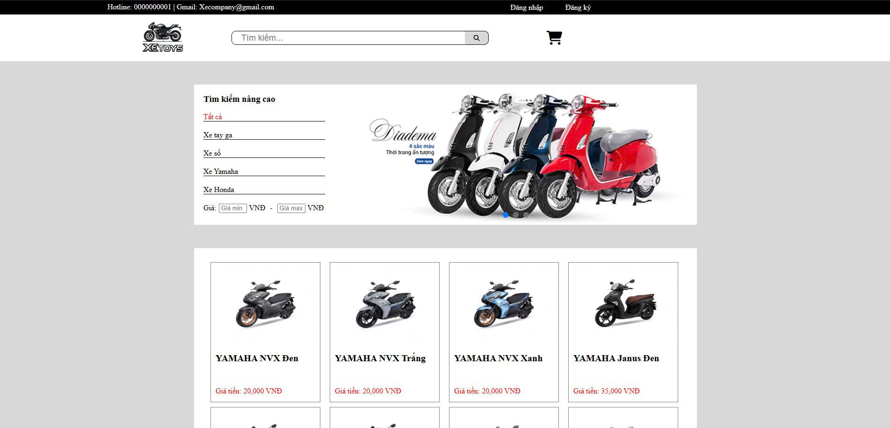

# Portfolio
---

## Software Projects

### Bus Tracking & Schedule System
**Duration:** Mar 2026 – Apr 2026  

A real-time bus tracking and scheduling system that allows users to monitor bus locations and check upcoming schedules. The system provides live updates using real-time communication technology.

)

**Features**
- Real-time bus tracking
- Bus schedule management
- Live updates using WebSocket
- Route and station management

**Technologies**
- Node.js  
- Socket.io  
- JavaScript  

---

### FreelancerWeb
**Duration:** Jan 2026 – Feb 2026  

A web platform that connects clients and freelancers, allowing businesses to post projects and freelancers to find job opportunities.

)

**Features**
- Project posting system
- Freelancer and client accounts
- Project browsing and filtering
- Web dashboard for project management

**Technologies**
- Laravel  
- PHP  
- Blade  
- MySQL  

---

### Cafe Management System
**Duration:** Dec 2025 – Jan 2026  

A desktop application used for managing operations in a coffee shop such as orders, billing, and product management.

)

**Features**
- Order management
- Product and inventory management
- Bill calculation
- Data storage with database

**Technologies**
- Java  
- JDBC  
- MySQL  

---

### Minesweeper Game
**Duration:** Oct 2025 – Nov 2025  

A classic Minesweeper game where players must uncover tiles while avoiding hidden mines.

)

**Features**
- Random mine generation
- Win/Loss detection
- Interactive game board
- Timer and score tracking

**Technologies**
- Python  
- Pygame  

---

### MotoMarket Website
**Duration:** Sep 2025 – Oct 2025  

A simple e-commerce website for buying and selling motorcycles online.

)

**Features**
- Product listing
- Product details page
- Responsive web design
- Simple shopping interface

**Technologies**
- HTML  
- CSS  
- JavaScript  

---

## About Me

I am a Software Engineering student at Saigon University who enjoys building software applications and solving real-world problems through technology. My interests include backend development, web development, and software system design.

---

## Contact

GitHub: https://github.com/akyy0707  

Email: your_email@gmail.com

---

© 2026 Anh Ky Portfolio
